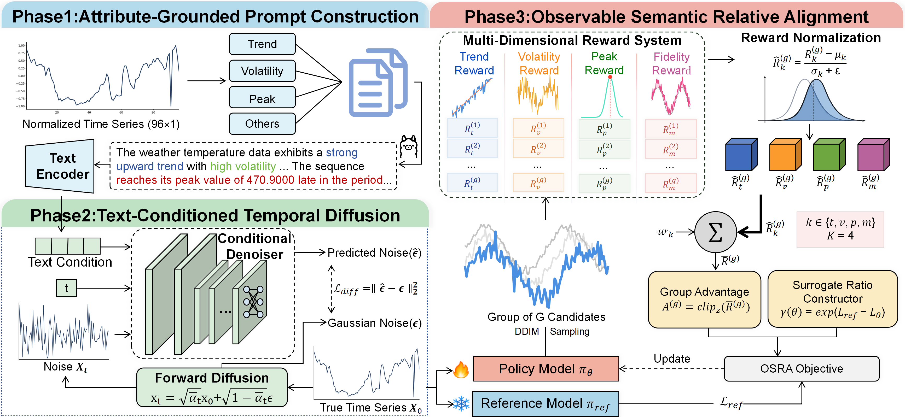
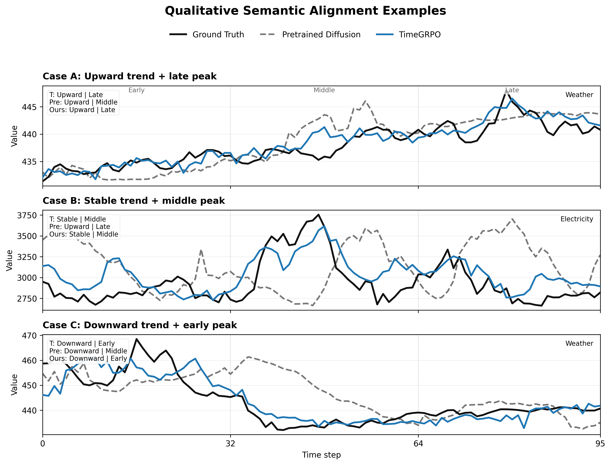

# SemAlign-TS

Official implementation for **SemAlign-TS: Observable Semantic Alignment for Controllable Text-to-Time-Series Generation**.

SemAlign-TS is a diffusion-based framework for controllable text-to-time-series generation. It separates **textual conditioning** from **observable semantic alignment**: natural-language prompts provide the input interface, while generated sequences are aligned using measurable temporal attributes such as trend direction, volatility level, and peak timing.

<p align="center">
  
</p>

<p align="center">
  <em>Overview of the SemAlign-TS framework.</em>
</p>

## Overview

Existing text-to-series generators usually inject prompt information through text embeddings or cross-attention. However, conditioning on a text prompt does not guarantee that the generated time series satisfies the requested observable semantics.

SemAlign-TS addresses this gap through three stages:

1. **Attribute-grounded prompt construction**
   Time-series windows are converted into natural-language descriptions using observable meta-features such as trend, volatility, and peak location.

2. **Text-conditioned temporal diffusion pretraining**
   A compact conditional diffusion denoiser is pretrained using text embeddings as the conditioning interface.

3. **Observable Semantic Relative Alignment (OSRA)**
   Multiple candidates generated under the same prompt are compared using decomposed semantic rewards. The model is then aligned toward candidates that better satisfy observable temporal semantics.

<p align="center">
  
</p>

<p align="center">
  <em>Qualitative examples comparing the pretrained diffusion baseline and SemAlign-TS.</em>
</p>

## Project Structure

```text
SemAlign-TS/
├── README.md
├── requirements.txt
├── LICENSE
├── diff_train.py                  # Step 1: diffusion pretraining
├── osra_train.py                  # Step 2: OSRA fine-tuning
├── evaluate.py                    # Step 3: evaluation
├── diffusion_core/                # Diffusion model and scheduler
├── reward_core/                   # Observable semantic reward functions
├── scripts/                       # Reproduction scripts
├── Data/                          # Preprocessed datasets, not tracked by Git
│   └── README.md
├── assets/                        # Figures used in this README
│   ├── framework.png
│   └── qualitative.png
├── checkpoints/                   # Created at runtime
├── logs/                          # Created at runtime
└── evaluation_results/            # Created at runtime
```

## Requirements

We recommend Python 3.10+ and a CUDA-capable GPU.

Install dependencies with:

```bash
pip install -r requirements.txt
```

If PyTorch is not installed, install the version matching your CUDA environment first. For example:

```bash
pip install torch --index-url https://download.pytorch.org/whl/cu124
```

## Data Preparation

The preprocessed datasets are not included in this repository because the files are large.

Please download the preprocessed archives from the following Google Drive folder:

```text
https://drive.google.com/drive/folders/1WMdnKq43XDmWsmpZUvas3CFbu-QhZtyC?usp=sharing
```

The folder contains separate archives for the six datasets:

```text
electricity.tar.gz
etth1.tar.gz
ettm1.tar.gz
exchange_rate.tar.gz
traffic.tar.gz
weather.tar.gz
SHA256SUMS.txt
```

Place the downloaded `.tar.gz` files under the project root and extract them:

```bash
tar -xzf etth1.tar.gz
tar -xzf ettm1.tar.gz
tar -xzf electricity.tar.gz
tar -xzf exchange_rate.tar.gz
tar -xzf traffic.tar.gz
tar -xzf weather.tar.gz
```

After extraction, the expected directory structure is:

```text
SemAlign-TS/
└── Data/
    ├── etth1/
    │   ├── etth1_X.npy
    │   ├── etth1_emb.npy
    │   ├── etth1_emb_mask.npy
    │   ├── etth1_meta.pkl
    │   └── etth1_train_indices.npy
    ├── ettm1/
    ├── electricity/
    ├── exchange_rate/
    ├── traffic/
    └── weather/
```

Text embeddings are stored in `float16` to reduce artifact size and are cast to `float32` during loading.

To verify downloaded files, run:

```bash
sha256sum -c SHA256SUMS.txt
```

## Reproduction Pipeline

Run the following commands from the project root.

### Step 1: Diffusion Pretraining

```bash
python diff_train.py --dataset etth1
```

The pretrained diffusion checkpoint is saved to:

```text
checkpoints/diff_train/etth1/best_model.pt
```

### Step 2: OSRA Fine-Tuning

```bash
python osra_train.py --dataset etth1
```

The OSRA-aligned checkpoint is saved to:

```text
checkpoints/osra/main/etth1/best_model.pt
```

### Step 3: Evaluation

Evaluate the pretrained diffusion baseline:

```bash
python evaluate.py --dataset etth1 --mode diff_train
```

Evaluate SemAlign-TS after OSRA fine-tuning:

```bash
python evaluate.py --dataset etth1 --mode osra
```

Evaluation results are written to:

```text
evaluation_results/diff_train/
evaluation_results/osra/
```

## Running All Datasets

To run all datasets, use the scripts under `scripts/`:

```bash
bash scripts/train_all.sh
bash scripts/eval_all.sh
```

The supported dataset names are:

```text
etth1
ettm1
electricity
exchange_rate
traffic
weather
```

## Evaluation Metrics

We report two groups of metrics.

| Category                  | Metrics                                                                       |
| ------------------------- | ----------------------------------------------------------------------------- |
| Fidelity and distribution | MSE, MAE, DTW, KLD                                                            |
| Semantic controllability  | Trend Accuracy, Volatility Accuracy, Peak Accuracy, Average Semantic Accuracy |

Semantic metrics are computed from observable attributes extracted from generated sequences and compared with the requested prompt-level labels.

## Notes

* `Data/`, `checkpoints/`, `logs/`, and `evaluation_results/` are excluded from Git tracking.
* The repository contains code and instructions for reproducing the main pipeline.
* Large preprocessed data archives are provided separately through Google Drive.
* OSRA stands for **Observable Semantic Relative Alignment**.

## Citation

```bibtex
@inproceedings{semalign-ts,
  title     = {SemAlign-TS: Observable Semantic Alignment for Controllable Text-to-Time-Series Generation},
  author    = {Hongbang Ji and Yitao Jia and Leilei Sun and Liangzhe Han and Tongyu Zhu},
  booktitle = {Proceedings of the IEEE International Conference on Data Engineering},
  year      = {2026}
}
```

## License

This repository is released for research and reproducibility purposes.
