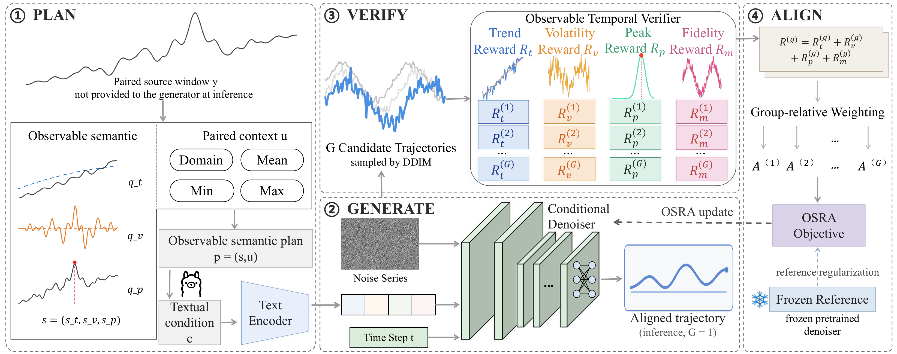

# SemAlign-TS

Official implementation of **SemAlign-TS: Observable Semantic Alignment for Controllable Text-to-Time-Series Generation**.

SemAlign-TS formulates controllable text-to-time-series generation as a closed-loop process:

**PLAN → GENERATE → VERIFY → ALIGN**

- **PLAN** specifies observable temporal intent, including trend, volatility, and peak location, together with paired context.
- **GENERATE** produces candidate trajectories with a text-conditioned diffusion model.
- **VERIFY** measures candidate-level semantic compliance and paired-reference fidelity directly in output space.
- **ALIGN** applies Observable Semantic Relative Alignment (OSRA), using group-relative feedback and frozen-reference regularization to update the denoiser.

The verification/alignment loop is used during training only. Inference uses a single aligned conditional generation (`G=1`) without verifier-based reranking.

## Framework



## Main results

Under the raw-observation-disjoint evaluation protocol across six datasets, SemAlign-TS obtains the following macro results:

| Metric | Result |
|---|---:|
| Trend Accuracy | 93.94% |
| Volatility Accuracy | 98.41% |
| Peak Accuracy | 94.46% |
| Joint-3 Accuracy | **87.79%** |
| MSE | 0.2709 |
| MAE | 0.4061 |
| DTW | **0.0912** |

The strongest external baseline reaches approximately **56.06% Joint-3**. A diagnostic direct LLaMA-3.1-8B-Instruct numerical-generation baseline reaches approximately **4.72% Joint-3**, indicating that general-purpose language modeling alone is insufficient for direct fine-grained controllable numerical time-series generation in this benchmark.

## Data

Processed main-experiment data are publicly available at:

https://drive.google.com/drive/folders/1OcRrBivZ-EXpqR6BMG163IlBjfokDJB2?usp=sharing

The release covers:

- Electricity
- ETTh1
- ETTm1
- Exchange Rate
- Traffic
- Weather

Official settings use sequence length 96, stride 1, and seeds `{42, 2026, 3407}`.
The raw timeline is partitioned before assigning windows to train/validation/test, and windows crossing split boundaries are excluded. Thus the official splits share no raw observations.

See [`Data/README.md`](Data/README.md) for archive contents.

## Installation

```bash
conda create -n semalign-ts python=3.10 -y
conda activate semalign-ts
pip install -r requirements.txt
```

Extract the six public data archives into `data/processed/` before training or evaluation.

## Diffusion pre-training

```bash
python train_diffusion.py \
  --dataset electricity \
  --data_dir data/processed \
  --save_dir outputs/checkpoints/seed42/pretrain \
  --seed 42
```

## OSRA alignment

```bash
python train_osra.py \
  --dataset electricity \
  --data_dir data/processed \
  --pretrain_dir outputs/checkpoints/seed42/pretrain \
  --save_dir outputs/checkpoints/seed42 \
  --experiment_name osra \
  --group_size 8 \
  --seed 42
```

## DPO mechanism control

First construct preference pairs:

```bash
python prepare_dpo_pairs.py \
  --dataset electricity \
  --data_dir data/processed \
  --pretrain_dir outputs/checkpoints/seed42/pretrain \
  --output_dir outputs/dpo_pairs/seed42/electricity \
  --seed 42
```

Then train DPO:

```bash
python train_dpo.py \
  --dataset electricity \
  --data_dir data/processed \
  --pretrain_dir outputs/checkpoints/seed42/pretrain \
  --pair_dir outputs/dpo_pairs/seed42/electricity \
  --save_dir outputs/checkpoints/seed42/dpo \
  --seed 42
```

## Evaluation

```bash
python evaluate.py \
  --dataset electricity \
  --mode osra \
  --experiment_name osra \
  --protocol raw_disjoint \
  --data_dir data/processed \
  --seed 42 \
  --ckpt_dir outputs/checkpoints/seed42/osra/electricity \
  --result_root outputs/evaluation_9metrics \
  --ddim_steps 50
```

The paper-facing evaluation uses nine metrics:

- semantic alignment: Trend Accuracy, Volatility Accuracy, Peak Accuracy, Joint-3 Accuracy;
- paired trajectory fidelity: MSE, MAE, DTW;
- population-level fidelity: MDD, ACD.

## Repository structure

```text
SemAlign-TS/
├── README.md
├── LICENSE
├── requirements.txt
├── train_diffusion.py
├── train_osra.py
├── prepare_dpo_pairs.py
├── train_dpo.py
├── evaluate.py
├── diffusion_core/
├── reward_core/
├── Data/
└── assets/
```

This public repository intentionally keeps only the core implementation needed to understand and run SemAlign-TS. Large datasets, checkpoints, experiment outputs, paper-result snapshots, auxiliary launchers, and plotting utilities are distributed separately or omitted.

## Citation

```bibtex
@article{ji2026semalign,
  title   = {SemAlign-TS: Observable Semantic Alignment for Controllable Text-to-Time-Series Generation},
  author  = {Ji, Hongbang and Tao, Jiayi and Sun, Leilei and Han, Liangzhe and Zhu, Tongyu},
  journal = {Information Sciences},
  year    = {2026},
  note    = {Under review}
}
```

## License

This release is intended to retain the existing `LICENSE` file from the GitHub repository.
